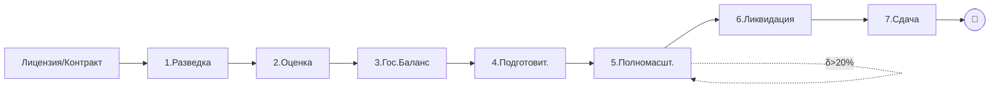

# 🛢️ Subsoil Vault — Home

> **Точка входа.** Если ты AI — начни с [[90.01-System-Prompt]]. Если человек — выбери роль ниже.

## 🚦 Quick start по роли

> [!tip] Кто ты?
> - 👷 **Недропользователь / оператор** → [[60.01-Operator]]
> - 🛠️ **Буровой подрядчик** → [[60.02-Drilling-Contractor]]
> - 🌊 **Геофизический подрядчик** → [[60.03-Geophysical-Contractor]]
> - 🧪 **Тампонажный подрядчик** → [[60.04-Cementing-Contractor]]
> - ⚖️ **Юрист / комплаенс** → [[60.06-Legal-Advisor]]
> - 🏛️ **Регулятор** → [[03-Authorities-MOC]]

## 📍 Главные MOC

- [[01-Stages-MOC]] — 7 этапов недропользования
- [[02-Regulations-MOC]] — КОНН, ЭК, ЕПРКИН, приказы
- [[03-Authorities-MOC]] — МЭиПР, ГКЗ, ЦКРР, МД и др.
- [[04-Documents-MOC]] — все проектные документы
- [[05-Roles-MOC]] — участники процесса
- [[06-Workflows-MOC]] — сквозные процессы
- [[07-AI-Training-MOC]] — материалы для AI
- [[25.00-Karatobe-Fund-MOC]] — промысел: фонд Каратюбе, изоляция водопритока, режимы скважин

## 🧭 Жизненный цикл

## 🎯 Топ-сценарии (FAQ)

- [[FAQ-First-Day-After-Contract]] — Что делать в день регистрации контракта?
- [[FAQ-Discovered-Reservoir]] — На разведке нашли залежь — что дальше?
- [[FAQ-Reserve-Delta-20]] — Запасы изменились >20%. Что делать?
- [[FAQ-Payment-Blocked]] — Подрядчик не получает оплату — почему?
- [[FAQ-Author-Supervision]] — Когда подавать отчёт авторнадзора?
- [[FAQ-Return-Territory]] — Как вернуть часть участка?
- [[FAQ-Liquidation-Trigger]] — Когда обязательна ликвидация?
- [[FAQ-Complex-Contract]] — Что значит «сложный проект»?
- [[FAQ-Offshore-Project]] — Особенности морских проектов
- [[FAQ-Large-Field]] — Месторождение >100 млн т — что нужно?
- [[FAQ-Subcontractor-Payment]] — Платёжные обязательства подрядчиков
- [[FAQ-Well-Passport]] — Зачем нужен паспорт скважины?

## 🧱 Фундамент — обязательно прочитать

- [[10.01-What-is-Subsoil-Use]] — что такое недропользование
- [[10.02-License-vs-Contract]] — два режима
- [[10.03-Contract-Complexity]] — сложные vs обычные проекты
- [[10.04-Key-Terminology]] — глоссарий
- [[10.05-Regulatory-Map]] — карта согласований
- [[10.06-Why-AI-Assistant]] — зачем AI
- [[10.07-Mental-Models]] — базовые ментальные модели
- [[10.08-Common-Workflow]] — общий рабочий процесс

## 📊 Сводная таблица этапов

| # | Этап | Срок | Документы | Авторнадзор |
|---|------|------|-----------|-------------|
| 1 | [[20.01.00-Overview\|Разведка]] | до закрепления оценки | 1 | ✅ |
| 2 | [[20.02.00-Overview\|Оценка]] | до 3 лет на залежь | 4 | ✅ |
| 3 | [[20.03.00-Overview\|Гос.Баланс]] | 3 мес на подсчёт | 2 | — |
| 4 | [[20.04.00-Overview\|Подготовительный]] | ≤ 3 лет | 4 | ✅ |
| 5 | [[20.05.00-Overview\|Полномасштабная]] | ≤ 25 (45) лет | 2 | ✅ |
| 6 | [[20.06.00-Overview\|Ликвидация]] | по факту | 1 | — |
| 7 | [[20.07.00-Overview\|Сдача]] | после акта | 2 | — |

## 🔥 Часто упоминаемые статьи

- [[40-KONN-Art-134]] — проекты разведочных работ
- [[40-KONN-Art-138]] — ликвидация последствий
- [[40-KONN-Art-142]] — авторский надзор
- [[40-EK-Art-67]] — ОВВ/РООС
- [[40-EK-Art-68]] — заявление о намечаемой деятельности

## 🤖 AI-Помощник

> [!example] Запустить AI-помощника
> **[[AI-Chat|Открыть чат с AI-помощником →]]**
> Или запусти в терминале: `./start.sh --watch` (Obsidian sync) | `./start.sh --web` (браузер)

- [[90.01-System-Prompt]] · [[90.02-Query-Patterns]] · [[90.03-Few-Shot-Examples]]
- [[90.06-Reasoning-Chains]] · [[90.07-Edge-Cases]] · [[90.09-Fine-Tuning-Dataset]]

---
*Last sync с регуляторикой: 10.06.2025 (КОНН), 29.07.2025 (ЭК), 24.09.2024 (ЕПРКИН).*
