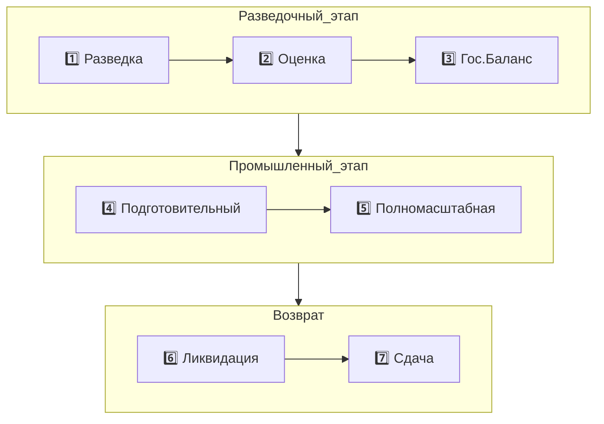
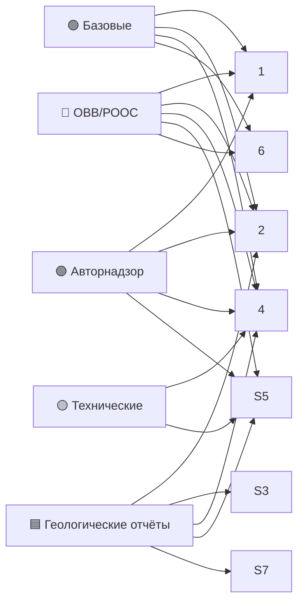

# 📍 7 этапов недропользования — MOC

> **Центральный навигатор** по жизненному циклу. Каждый этап — отдельная папка с ~12 атомарными заметками.

## Карта



## Сводная таблица

| # | Этап | Срок | Ключевые статьи | Документы | Авторнадзор |
|---|------|------|-----------------|-----------|-------------|
| 1 | [[20.01.00-Overview\|Разведка]] | до закрепления оценки | КОНН 134, 135 | 1 | ✅ |
| 2 | [[20.02.00-Overview\|Оценка]] | до 3 лет на залежь | КОНН 134-136, 138 | 4 | ✅ |
| 3 | [[20.03.00-Overview\|Гос.Баланс]] | 3 мес. | КОНН 6, 142 | 2 | — |
| 4 | [[20.04.00-Overview\|Подготовительный]] | ≤ 3 лет | КОНН 137, 138 | 4 | ✅ |
| 5 | [[20.05.00-Overview\|Полномасштабная]] | ≤ 25 (45) лет | КОНН 119, 137 | 2 | ✅ |
| 6 | [[20.06.00-Overview\|Ликвидация]] | по факту | КОНН 107, 114, 116, 138 | 1 | — |
| 7 | [[20.07.00-Overview\|Сдача]] | после акта | КОНН 107, 114, 116 | 2 | — |

## Точки перехода

- **1→2:** обнаружена залежь, оператор готовит оценочный проект
- **2→3:** оперативный подсчёт готов, нужен официальный подсчёт для гос.баланса
- **3→4:** ГКЗ утвердил запасы, оператор готовится к добыче
- **4→5:** закреплён горный отвод, проект разработки утверждён
- **5→6:** право прекращено / возврат участка
- **6→7:** все ликвидационные работы выполнены, нужно сдать акт

## Универсальная структура каждой стадии (12 заметок на стадию)

```
20.XX-Stage/
├── 20.XX.00-Overview.md         ← TL;DR + ментальная модель
├── 20.XX.01-Project-Document.md ← главный проектный документ
├── 20.XX.02-OVVS-ROOS.md        ← экологическая часть
├── 20.XX.03-Phases.md           ← фазы I-VII
├── 20.XX.04-Authorities.md      ← кто согласовывает
├── 20.XX.05-Author-Supervision.md ← авторнадзор (где есть)
├── 20.XX.06-Common-Mistakes.md  ← типовые ошибки
├── 20.XX.07-FAQ.md              ← частые вопросы
├── 20.XX.08-Checklist.md        ← финальный чек-лист
├── 20.XX.09-Deadlines.md        ← таймлайн
├── 20.XX.10-AI-Training.md      ← Q&A для AI-обучения
└── 20.XX.11-Examples.md         ← реальные кейсы
```

## По типу проектных документов



## По ролям

- [[60.01-Operator]] — что делает на каждом этапе
- [[60.02-Drilling-Contractor]] — где встроен (1, 2, 4, 5)
- [[60.03-Geophysical-Contractor]] — этапы 1, 2, 5
- [[60.04-Cementing-Contractor]] — этапы 2, 4, 5

## See also

- [[00-Home]] · [[02-Regulations-MOC]] · [[06-Workflows-MOC]]
