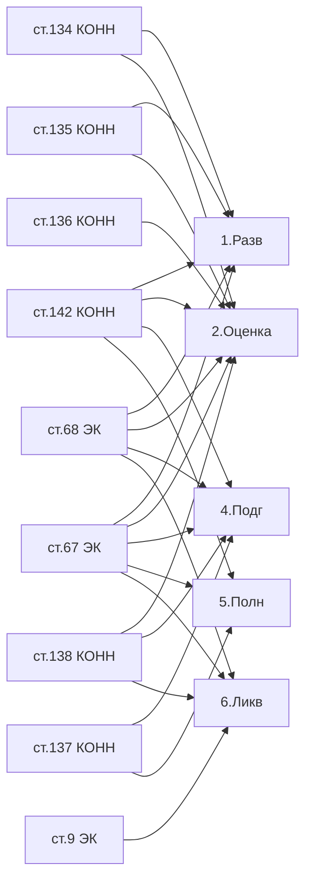

# ⚖️ Регуляторика — MOC

> Три кита: **КОНН** (что можно), **ЭК** (как соблюсти экологию), **ЕПРКИН** (как оформить).

## 🟢 КОНН РК — Кодекс о недрах

[[40-KONN-Overview]] — №125-VI от 27.12.2017, изм. **10.06.2025**

| Статья | Тема | Где применяется |
|--------|------|-----------------|
| [[40-KONN-Art-6]] | Полномочия КОНН | этапы 3 |
| [[40-KONN-Art-90]] | Порядок сдачи отчётов | этап 7 |
| [[40-KONN-Art-107]] | Прекращение права | этапы 6, 7 |
| [[40-KONN-Art-113]] | Морские проекты и увеличение участка | этап 1 (исключение) |
| [[40-KONN-Art-114]] | Добровольный возврат части | этапы 6, 7 |
| [[40-KONN-Art-116]] | Досрочное прекращение разведки | этапы 6, 7 |
| [[40-KONN-Art-119]] | Контракт на добычу + крупные месторождения | этап 5 |
| [[40-KONN-Art-134]] | Проекты разведочных работ | этапы 1, 2 |
| [[40-KONN-Art-135]] | Проекты разведочных работ (продолжение) | этапы 1, 2 |
| [[40-KONN-Art-136]] | Пробная эксплуатация | этап 2 |
| [[40-KONN-Art-137]] | Проект разработки месторождения | этапы 4, 5 |
| [[40-KONN-Art-138]] | Ликвидация последствий | этапы 2, 4, 6 |
| [[40-KONN-Art-142]] | Авторский надзор | этапы 1, 2, 3, 4, 5 |

## 🌿 ЭК РК — Экологический кодекс

[[40-EK-Overview]] — №400-VI от 02.01.2021, изм. **29.07.2025**

| Статья | Тема |
|--------|------|
| [[40-EK-Art-9]] | Проект ликвидации (этап 6) |
| [[40-EK-Art-67]] | ОВВ/РООС |
| [[40-EK-Art-68]] | Заявление о намечаемой деятельности |

## 📘 ЕПРКИН

[[40-EPRKIN-Overview]] — Приказ №239 от 15.06.2018, изм. **24.09.2024**

- [[40-EPRKIN-Ch5-Author-Supervision]] — глава 5 (авторнадзор)
- [[40-EPRKIN-P55-Notification]] — п. 55 (уведомительный порядок)

## 🏛️ Подзаконные акты

| Документ | Тема | Дата |
|----------|------|------|
| [[40-MIIR-Order-71]] | Методика классификации запасов | 02.02.2023 |
| [[40-MIIR-Order-419]] | Формы отчётов по геологическому изучению недр | 31.05.2018 (изм. 25.08.2020 №200) |
| [[40-ME-Order-200]] | Правила консервации и ликвидации | 22.05.2018 (изм. 11.10.2024 №66) |
| [[40-ME-Order-356]] | Промбезопасность на море | 30.12.2014 (изм. 04.08.2023) |
| [[40-ME-Order-355]] | Промбезопасность нефтегазовой отрасли | 30.12.2014 |
| [[40-Order-27-NK]] | Методика расчёта обеспечения по ликвидации | 17.01.2025 |
| [[40-Law-188-V]] | Закон «О гражданской защите» | 11.04.2014 (изм. 31.08.2025) |
| [[40-SN-RK-1-02-03-2022]] | Порядок согласования проектной документации | 2022 |

## Карта: какая статья на каком этапе

## See also

- [[00-Home]] · [[01-Stages-MOC]] · [[03-Authorities-MOC]]
