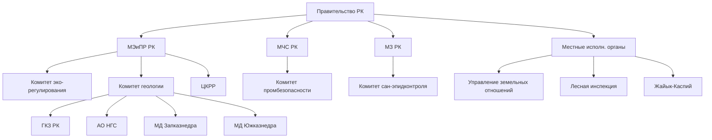
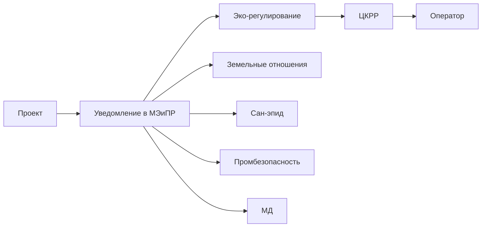
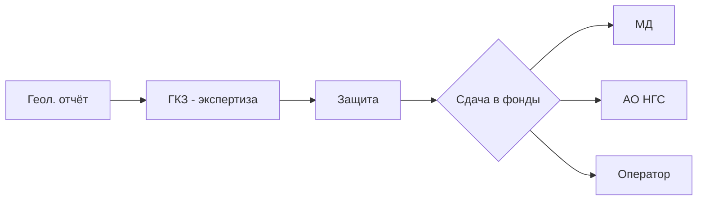
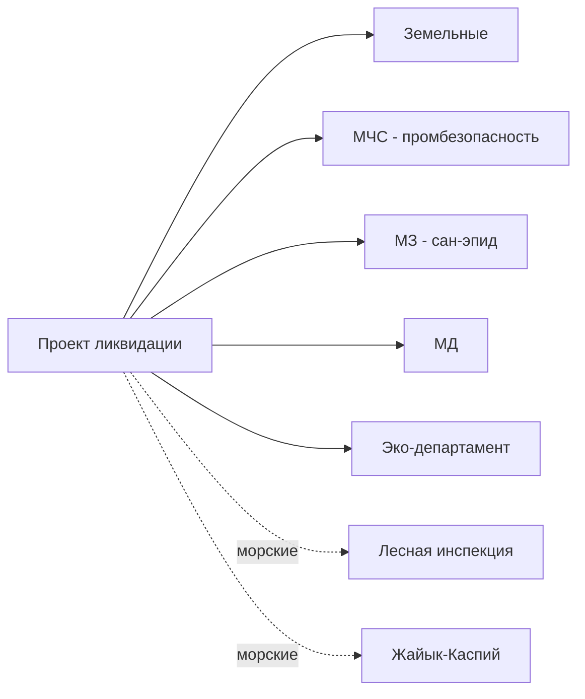

# 🏛️ Государственные органы — MOC

## Иерархия

## Карточки органов

### Республиканский уровень
- [[50-MEMINPR]] — Министерство энергетики и природных ресурсов РК
- [[50-Committee-Eco-Regulation]] — Комитет эко-регулирования
- [[50-Committee-Geology]] — Комитет геологии
- [[50-GKZ]] — Государственная Комиссия по Запасам (ГКЗ РК)
- [[50-TCKRR]] — Центральная Комиссия по Разведке и Разработке (ЦКРР)
- [[50-NGS]] — АО «Национальная геологическая служба»
- [[50-MCHS]] — МЧС РК (Комитет промышленной безопасности)
- [[50-MZ]] — МЗ РК (Комитет сан-эпидконтроля)

### Региональный уровень
- [[50-MD-Zapkaznedra]] — МД «Запказнедра» (Атырау, Актобе, Мангистау, ЗКО)
- [[50-MD-Yuzhkaznedra]] — МД «Южказнедра» (Кызылорда, Туркестан, Алматы)
- [[50-Department-Eco-Region]] — Региональные департаменты экологии
- [[50-Department-Land]] — Управление земельных отношений
- [[50-Forestry-Inspection]] — Территориальная инспекция лесного хозяйства
- [[50-ZhaiykKaspii]] — Жайык-Каспийская бассейновая инспекция

## По функции

### Кто согласовывает базовые проекты?

### Кто согласовывает геологические отчёты?

### Кто согласовывает ликвидационные проекты?

## See also

- [[00-Home]] · [[01-Stages-MOC]] · [[02-Regulations-MOC]] · [[10.05-Regulatory-Map]]
