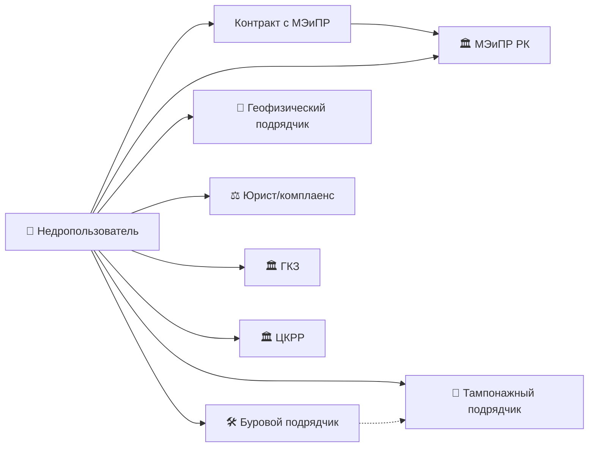
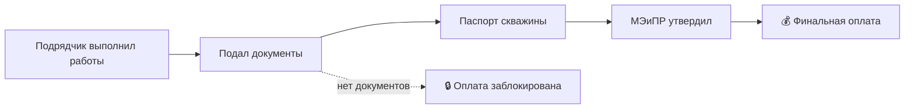

# 👥 Участники процесса — MOC

## Цепочка

## Карточки ролей

- [[60.01-Operator]] — недропользователь (лицензиат/оператор контракта)
- [[60.02-Drilling-Contractor]] — буровой подрядчик
- [[60.03-Geophysical-Contractor]] — геофизический подрядчик
- [[60.04-Cementing-Contractor]] — тампонажный подрядчик
- [[60.05-Regulator]] — регулятор (общая роль)
- [[60.06-Legal-Advisor]] — юрист / комплаенс-офицер

## Ключевой принцип: Payment Milestone Blocking

> 💰 **Финальная оплата подрядчику заблокирована до утверждения паспорта скважины МЭиПР.**

Это контрактный механизм, который делает документарное соблюдение **non-negotiable** для подрядчиков. Подробно: [[70.01-Payment-Milestones]].

## Кто что делает на каждом этапе

| Этап | Оператор | Буровой | Геофиз. | Тампонаж. |
|------|----------|---------|---------|-----------|
| 1.Разв | проект | поисковые скв. | сейсмика 3Д/2Д | поисковые цементир. |
| 2.Оценка | проект | оценочные скв. | ГИС, ГДИС | оценочные цементир. |
| 3.Баланс | подсчёт | — | данные ГИС | — |
| 4.Подг. | проект разр. | — | — | — |
| 5.Полн. | проект | добывающие скв. | ГИС в добыв. | добыв. цементир. |
| 6.Ликв. | проект ликв. | ликвидация скв. | — | тампонаж устья |
| 7.Сдача | финальный отчёт | — | — | — |

## See also

- [[00-Home]] · [[70.01-Payment-Milestones]] · [[70.03-Well-Passport-Lifecycle]]
