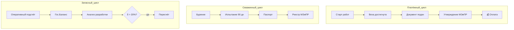

# 🔄 Сквозные процессы — MOC

Процессы, тянущиеся через несколько этапов.

## Карточки процессов

- [[70.01-Payment-Milestones]] — платёжные вехи и блокировка оплаты
- [[70.02-90-Day-Testing-Cycle]] — 90-дневный цикл испытания скважины
- [[70.03-Well-Passport-Lifecycle]] — паспорт скважины как точка истины
- [[70.04-Reserve-Reclassification]] — перевод/пересчёт запасов
- [[70.05-Author-Supervision-Cycle]] — ежегодный авторнадзор
- [[70.06-Fines-and-Deadlines]] — штрафы за просрочку
- [[70.07-Document-Approval-Chain]] — типовая цепочка согласования

## Карта процессов

## See also

- [[00-Home]] · [[01-Stages-MOC]] · [[05-Roles-MOC]]
