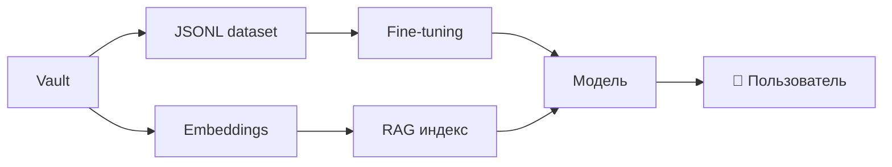

# 🤖 AI Training — MOC

> Это место, где собран **корпус для обучения AI** на этом vault'е. Используй для fine-tuning, RAG, embeddings.

## 📚 Материалы

### Промпт-инжиниринг
- [[90.01-System-Prompt]] — основной системный промпт
- [[90.02-Query-Patterns]] — шаблоны запросов пользователей
- [[90.03-Few-Shot-Examples]] — примеры few-shot обучения

### Retrieval (RAG)
- [[90.04-Retrieval-Strategy]] — стратегия поиска по vault'у
- [[90.08-Glossary-for-Embeddings]] — глоссарий для embedding-моделей
- [[90.10-RAG-Knowledge-Base]] — структура knowledge base

### Reasoning
- [[90.06-Reasoning-Chains]] — цепочки рассуждений (Chain-of-Thought)
- [[90.07-Edge-Cases]] — граничные кейсы

### Безопасность
- [[90.05-Refusal-Patterns]] — когда AI должен отказать

### Дата-сет
- [[90.09-Fine-Tuning-Dataset]] — готовый JSONL для fine-tuning

## Источники данных

- **Стенд КазНИГРИ** (verbatim): `99-Source-Stand/`
- **Атомарные заметки** по этапам: `20-Stages/*`
- **FAQ-сценарии**: `95-FAQ/*`
- **Q&A в каждой стадии**: `20.XX.10-AI-Training.md`

## Workflow обучения AI

## See also

- [[00-Home]] · [[90.01-System-Prompt]]
