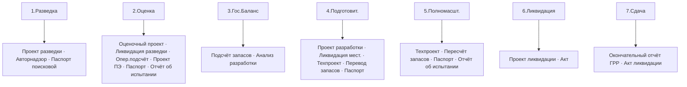

# 📑 Отчёты и паспорта по этапам — MOC

> На каждом из 7 этапов есть что «выпустить». Помощник **проактивно предлагает** документ.

## Карта: что генерируем на каждом этапе

## Заметки по этапам

- [[35.00-Report-Catalog]] — полный каталог документов
- [[35.01-Stage-1-Reports]] · [[35.02-Stage-2-Reports]] · [[35.03-Stage-3-Reports]]
- [[35.04-Stage-4-Reports]] · [[35.05-Stage-5-Reports]] · [[35.06-Stage-6-Reports]] · [[35.07-Stage-7-Reports]]

## PDF-шаблоны

- 📄 Паспорт скважины — `PDF/Shablon-Pasport-Skvazhiny.pdf`
- 📄 Отчёт об испытании — `PDF/Shablon-Otchet-Ispytanie.pdf`
- 📄 Отчёт по этапу — `PDF/Shablon-Otchet-po-Etapu.pdf`

## Управленческий учёт

- [[85.01-Management-Accounting-Overview]] · [[85.02-Cost-Centers]] · [[85.03-Payment-Events]] · [[85.04-KPI-Deadlines]]

## Поведение AI

- [[90.14-Proactive-Report-Offering]] — как помощник предлагает документы

## See also

- [[00-Home]] · [[04-Documents-MOC]]
