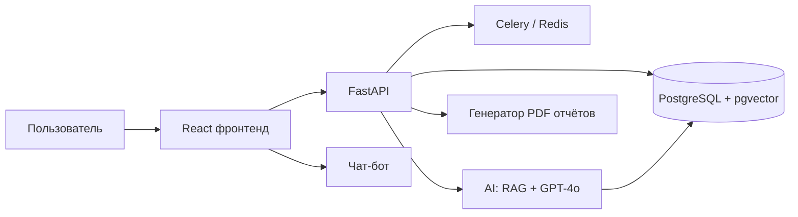

# 🏗️ Subsoil Management — MOC

## Разделы
- [[40.01-ERP-Architecture]] — архитектура и стек
- [[40.02-Data-Model]] — модель данных (DocTypes)
- [[40.03-Screens]] — 6 экранов
- [[40.04-Button-Report-Map]] — какая кнопка какой отчёт выдаёт
- [[45.01-CRM-Overview]] · [[45.02-CRM-Pipeline]] · [[45.03-CRM-Entities]]
- [[46.01-Chatbot-Integration]] — интеграция AI-бота
- [[47.01-API-Endpoints]] — REST API

## See also
- [[00-Home]] · [[08-Reports-By-Stage-MOC]] · [[90.13-Production-RAG-Pipeline]]
