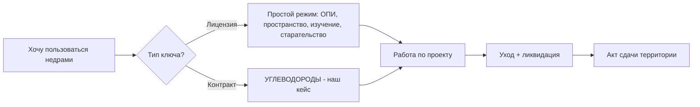

# 🧱 Что такое недропользование

## TL;DR

**Недропользование** — деятельность по разведке, добыче и использованию недр на основании права (лицензия или контракт). В РК регулируется [[40-KONN-Overview|Кодексом о недрах]].

## Ментальная модель

> Представь недра как **огромный склад**. Государство — арендодатель. Ты — арендатор. Условия:
> 1. Заплати за вход (бонус, налоги, обеспечение)
> 2. Делай **только** то, что разрешено в проекте
> 3. Каждые N лет отчитывайся, что нашёл и вынес
> 4. Когда уходишь — приведи всё в порядок (ликвидация)
> 5. Большая комиссия проверит — и тогда выдаст «акт сдачи»

## Виды недропользования (по [[40-KONN-Overview|КОНН]])

- **Углеводороды** (нефть, газ, конденсат) ← наша система
- Твёрдые полезные ископаемые (руды, уголь)
- Общераспространённые ПИ (песок, щебень, глина)
- Старательство
- Геологическое изучение недр
- Использование пространства недр

## Зачем это важно для оператора и подрядчиков

- **Оператор** = лицо с правом недропользования. **Несёт юридическую ответственность.**
- **Подрядчик** (буровой / геофизический / тампонажный) выполняет работы по договору.

⚠️ Перед государством отвечает **оператор**, но финансовые штрафы обычно перетекают подрядчику через договорные обязательства. См. [[70.01-Payment-Milestones]].

## Источники

- [[40-KONN-Overview|КОНН РК №125-VI от 27.12.2017]]
- [[99-Source-Stand/00-Index|Стенд КазНИГРИ (verbatim)]]

## See also

- [[10.02-License-vs-Contract]] · [[10.07-Mental-Models]] · [[01-Stages-MOC]]
