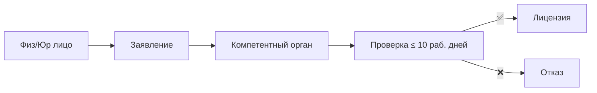
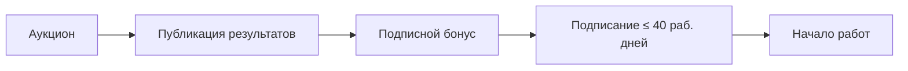

# 🔑 Лицензия vs Контракт — два режима

## TL;DR

Право на недропользование получают **двумя способами**:
- **Лицензия** — заявил, заплатил, получил (10 раб. дней)
- **Контракт** — победил на аукционе, заплатил бонус, подписал (40 раб. дней)

> 🚨 Для **углеводородов** — **только контрактный режим**. Лицензионный — для ОПИ, пространства недр, изучения и старательства.

## Лицензионный режим

| Тип лицензии | Срок |
|--------------|------|
| Геологическое изучение недр | **3 года** |
| Добыча ОПИ | **≤ 25** последовательных лет |
| Использование пространства недр | **≤ 25** последовательных лет |
| Старательство | **3 года** |

## Контрактный режим

### Типы контрактов

| Тип | Срок | Структура |
|-----|------|-----------|
| Обычный (не сложный) | ≤ 12 лет | 6 + 3 + 3 |
| Сложный | 18 лет | 9 + 6 + 3 |
| На добычу УВ | ≤ 25 лет (45 для крупных/уникальных) | + продление до 25 |

См. [[10.03-Contract-Complexity]] для разбора сложности.

## Сравнительная таблица

| Параметр | Лицензия | Контракт |
|----------|----------|----------|
| Кому | Физ/юр лица | Юр лица (по итогам аукциона) |
| Срок выдачи | 10 раб. дней | 40 раб. дней |
| Подписной бонус | Нет | Есть |
| Для УВ | ❌ | ✅ |

## Источник

- [[99-Source-Stand/02-Legend-Licensing-Regime]] · [[99-Source-Stand/03-Legend-Contract-Regime]]

## See also

- [[10.03-Contract-Complexity]] · [[40-KONN-Art-119]]
