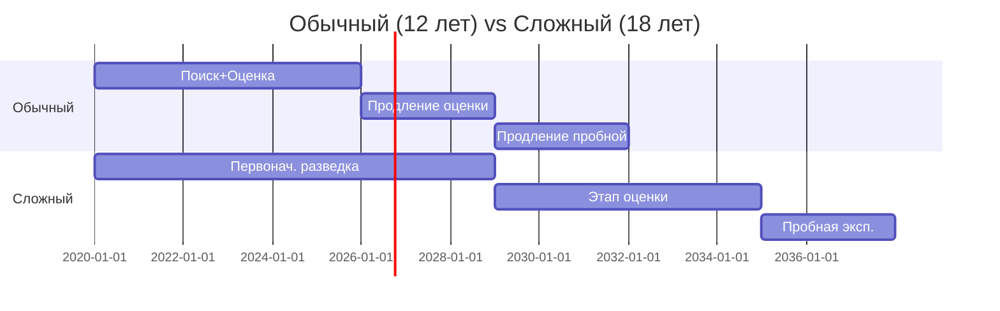

# 🎚️ Сложность контракта

## TL;DR

Если в процессе разведки/оценки появляются **признаки сложности**, контракт **должен быть обновлён**. Это меняет максимальный срок с 12 → 18 лет и **блокирует** дальнейшие фазы до обновления.

## Триггеры сложности

> Точный список — в актах МЭ. Типичные критерии:
- Глубина залегания > определённого порога
- Аномально высокое пластовое давление
- Высокое содержание H₂S / CO₂
- Морская локация
- Сложные геологические условия (соляные купола, надсолевые)

## Тайминги: обычный vs сложный



| | Обычный | Сложный |
|---|---------|---------|
| Общий срок | ≤ 12 лет | 18 лет |
| Структура | 6 + 3 + 3 | 9 + 6 + 3 |
| Переход между этапами | по времени | **по заявлению** |

## ⚠️ Блокирующее действие в системе

Когда оператор / AI замечает признаки сложности:

1. **STOP** — нельзя продолжать фазы ОВВ/РООС
2. Документально зафиксировать признаки сложности
3. Подать заявление в МЭиПР РК
4. Получить дополнение к контракту
5. Только после этого — продолжать

В Subsoil:
```python
if project.requires_complex_contract_update:
    block_phase_iii_ovvs_roos()
    notify_legal_advisor()
```

## Где упоминается на стенде

- В блоках [[22-Stage-2-Operativnyy-Podschet]] и [[30-Stage-3-Podschet-Zapasov]] есть прямая фраза:
  *«При выявлении критериев, характеризующих проект как сложный, требуется получение обновлённого контракта на недропользование»*

## See also

- [[10.02-License-vs-Contract]] · [[40-KONN-Art-119]] · [[FAQ-Complex-Contract]]
