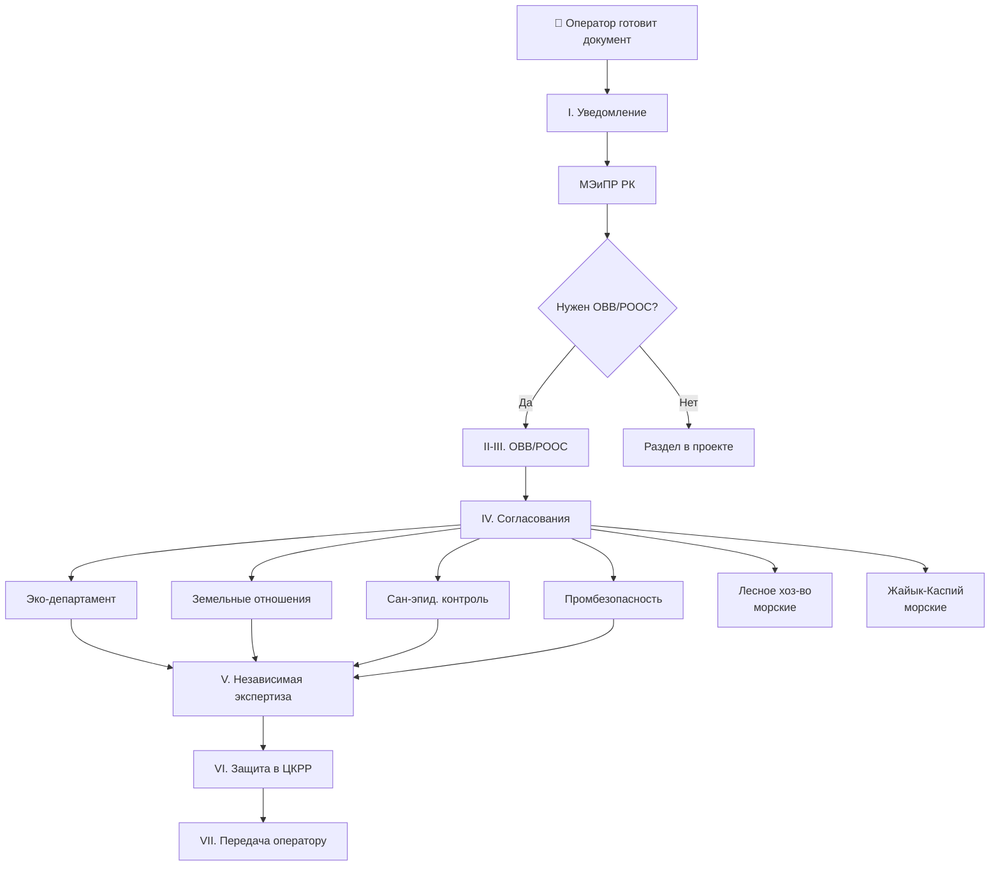
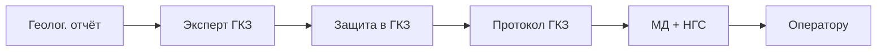

# 🗺️ Карта согласований

## TL;DR

Каждый проектный документ проходит **до 7 фаз** через разные органы. Это карта.

## Полная цепочка для базового проекта

## Для геологических отчётов

## По типам документов

| Документ | Главный путь | Главные органы |
|----------|--------------|----------------|
| Базовый проект | Уведомительно + ЦКРР | МЭиПР, эко-департ, ЦКРР |
| ОВВ/РООС | Незав. экспертиза | Эко-департ + ЦКРР |
| Геол. отчёт | Защита в ГКЗ + фонды | ГКЗ, МД, НГС |
| Авторнадзор | Уведомительно | МЭиПР |
| Ликвидация | Полная цепочка | МЭиПР + МЧС + МЗ + эко |
| Финальный отчёт | Защита МД + фонды | МД + НГС |

## See also

- [[02-Regulations-MOC]] · [[03-Authorities-MOC]] · [[70.07-Document-Approval-Chain]]
