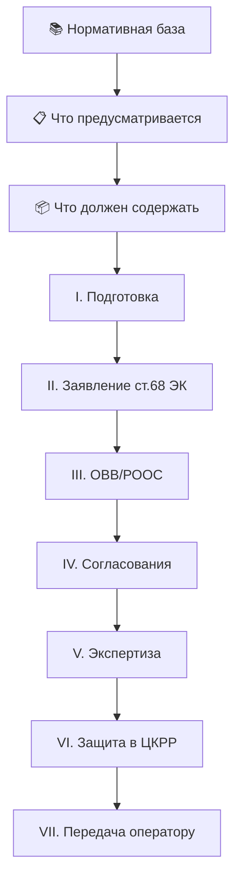

# 🔁 Универсальный шаблон документа

Каждый базовый проектный документ проходит **один и тот же скелет**:

## Что меняется от документа к документу

- **Статья КОНН** (134 для разведки, 137 для разработки, 138 для ликвидации)
- **Состав требований** (что содержать)
- **Цепочка согласований** (для морских — добавляются Лесная инспекция и Жайык-Каспий)
- **Уведомительный vs экспертный** порядок

## Универсальный скелет содержания (для AI)

Любой базовый проект содержит:

1. Описание целей и задач
2. Нормативная база (список ссылок)
3. Что предусматривается (виды работ)
4. Что должен содержать (детали)
5. Размер обеспечения по ликвидации ([[40-Order-27-NK]])
6. Мероприятия по охране недр и ООС

См. полный скелет: [[30-Common-Document-Skeleton]].

## Универсальный скелет геологического отчёта

Любой геолог. отчёт содержит:

1. Изучение геолого-геофизического разреза
2. Выделение пластов-коллекторов
3. Петрофизические зависимости
4. Количественное определение коллекторских свойств
5. Изучение флюидальной системы
6. Обоснование ВНК
7. **11 текстовых приложений** ([[30-Common-Geological-Attachments]])

## See also

- [[30-Common-Document-Skeleton]] · [[30-Common-Geological-Attachments]] · [[10.07-Mental-Models]]
