# 1️⃣ Разведка — Overview

## TL;DR

Этап **поиска** залежей УВ. Цель: обнаружить, определить ресурсы, дать предварительную геолого-экономическую оценку, обосновать дальнейшие работы.

## Ментальная модель

> Приехал на новое место → **щупаешь землю**: сейсмопрофили, пара поисковых скважин. Главный вопрос: **«есть ли тут вообще нефть?»**

## Ключевые цифры

- **Срок составления проекта:** 1 год со дня регистрации контракта
- **Период действия:** весь период разведки
- **Главные статьи:** [[40-KONN-Art-134]] + [[40-KONN-Art-135]]
- **ОВВ/РООС:** [[40-EK-Art-67]], [[40-EK-Art-68]]
- **Авторнадзор:** [[40-KONN-Art-142]] (ежегодно)

## Что должно быть на выходе

- ✅ Утверждённый [[20.01.01-Project-Document|Проект разведочных работ (поисковый этап)]]
- ✅ Согласованный [[20.01.02-OVVS-ROOS]]
- ✅ Пробурены поисковые скважины
- ✅ Проведена сейсморазведка 3Д/2Д
- ✅ Ежегодные [[20.01.05-Author-Supervision|отчёты авторнадзора]]

## Чего НЕ делается на этом этапе

- ❌ Оценка залежей — это [[20.02.00-Overview|этап 2]]
- ❌ Подсчёт запасов — это [[20.03.00-Overview|этап 3]]
- ❌ Промышленная разработка

## Поток

```mermaid
flowchart LR
    CONTRACT[Контракт зарегистрирован] -->|1 год| DOC[Проект разведки]
    DOC --> NOTIF[Уведомление в МЭиПР]
    NOTIF --> OVVS[ОВВ/РООС]
    OVVS --> APPR[Согласования]
    APPR --> TCKRR[ЦКРР]
    TCKRR --> WORK[Полевые работы]
    WORK --> SUPER[Авторнадзор ежегодно]
    SUPER -.->|залежь найдена| NEXT[Этап 2: Оценка]
```

## Структура папки

- [[20.01.00-Overview]] ← ты здесь
- [[20.01.01-Project-Document]] — главный документ
- [[20.01.02-OVVS-ROOS]] — экология
- [[20.01.03-Phases]] — фазы I-VII
- [[20.01.04-Authorities]] — кто согласовывает
- [[20.01.05-Author-Supervision]] — авторнадзор
- [[20.01.06-Common-Mistakes]] — ошибки
- [[20.01.07-FAQ]] — вопросы
- [[20.01.08-Checklist]] — чек-лист
- [[20.01.09-Deadlines]] — сроки
- [[20.01.10-AI-Training]] — Q&A для обучения AI
- [[20.01.11-Examples]] — примеры из практики

## See also

- [[01-Stages-MOC]] · [[99-Source-Stand/10-Stage-1-Razvedka|Verbatim источник]]
- [[20.02.00-Overview|→ Этап 2: Оценка]]
