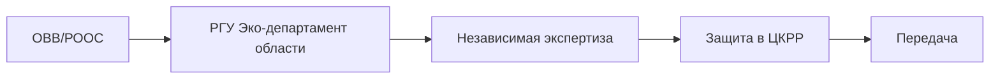

# 🌿 Этап 1 — ОВВ/РООС

## Карточка

| Параметр | Значение |
|----------|----------|
| Регулирование | [[40-EK-Art-67]] · [[40-EK-Art-68]] |
| Триггер | В рамках проекта разведки или отдельным разделом |
| Согласует | [[50-Department-Eco-Region]] + [[50-TCKRR]] |

## ОВВ vs РООС

- **ОВВ** = Отчёт о Возможных Воздействиях (отдельный документ)
- **РООС** = Раздел Охраны Окружающей Среды (раздел в проекте)

> 💡 **МЭиПР РК** решает, что именно нужно, после рассмотрения [[40-EK-Art-68|заявления о намечаемой деятельности]] (фаза II).

## Что предусматривается

- 🌳 Характеристика и оценка **современного состояния** ООС (атмосфера, гидросфера, литосфера, флора, фауна)
- 📊 Ранжирование факторов воздействия по приоритетам
- 🔬 Анализ **планируемой деятельности** — виды и интенсивность воздействия
- 📈 **Прогнозная оценка** ожидаемых изменений
- 🛡️ **Природоохранные мероприятия**

## Согласования

## See also

- [[20.01.00-Overview]] · [[30-OVVS-ROOS-Universal]] · [[40-EK-Art-67]]
