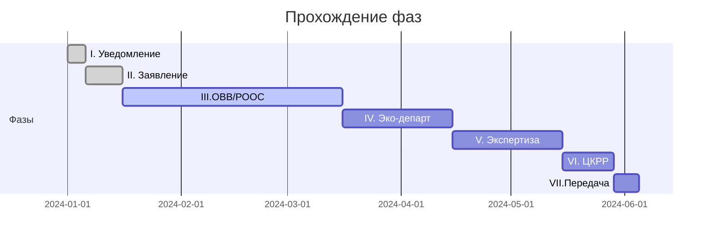

# 🎯 Этап 1 — Фазы прохождения

> 7 шагов от проекта на столе до утверждённого документа.

## Фаза I — Уведомление

**Действие:** Проект разведочных работ направляется в компетентный орган в **уведомительном порядке** и **НЕ подлежит** госэкспертизе.

**⚠️ Исключения** (требуется госэкспертиза):
- Морские проекты
- Увеличение участка недр по [[40-KONN-Art-113]]

**Орган:** [[50-MEMINPR]]

## Фаза II — Заявление о намечаемой деятельности

**Действие:** Подаётся **заявление** по [[40-EK-Art-68]].

**Зачем:** МЭиПР решает, **что именно** нужно: ОВВ или РООС.

## Фаза III — Разработка ОВВ/РООС

**Действие:** Готовится по [[40-EK-Art-67]] (изм. 29.07.2025).

**Содержание:** см. [[20.01.02-OVVS-ROOS]].

## Фаза IV — Согласование

**Орган:** [[50-Department-Eco-Region]] — РГУ «Департамент экологии … области» Комитета эко-регулирования и контроля МЭиПР РК.

## Фаза V — Независимая экспертиза

**Орган:** Компетентный орган ([[50-MEMINPR]]).

## Фаза VI — Защита в ЦКРР

**Орган:** [[50-TCKRR]]
**Артефакт:** Протокол ЦКРР

## Фаза VII — Передача недропользователю

**Действие:** Передача окончательного варианта оператору.

## Тайминг (типовой)

## See also

- [[20.01.00-Overview]] · [[10.05-Regulatory-Map]] · [[70.07-Document-Approval-Chain]]
