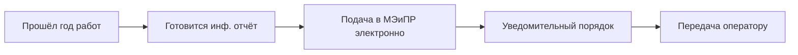

# 👀 Авторский надзор за разведочными работами по поиску

## Карточка

| Параметр | Значение |
|----------|----------|
| Регулирование | [[40-KONN-Art-142]] + [[40-EPRKIN-Ch5-Author-Supervision]] |
| Периодичность | **Ежегодно** |
| Орган | [[50-MEMINPR]] (уведомительно) |
| Формат | Электронный (п. 55 гл. 5 ЕПРКИН) |

## Что покрывает авторнадзор

> Изменения, которые **НЕ требуют** правки базового проекта:

- Изменения **графика бурения** (без уменьшения количества независимых скважин)
- Корректировка **местоположения** проектируемых скважин
- Изменения **видов и объёмов** исследовательских работ
- Корректировка **объектов испытания** и их количества

## Содержание отчёта

**Отражаются:**
- Соответствие фактических значений технологических параметров проектным
- Причины расхождений и невыполнения проектных решений
- Рекомендации по устранению недостатков

**Отчёт должен содержать:**
1. Новые данные о геологическом строении
2. Текущее состояние разведки
3. Состояние выполнения проектных решений
4. Рекомендации

## Workflow

## Фазы

- **I:** Подготовка информационного отчёта
- **II:** Направление в МЭиПР уведомительно (электронно)
- **III:** Передача оператору

## See also

- [[70.05-Author-Supervision-Cycle]] · [[40-KONN-Art-142]] · [[99-Source-Stand/11-Stage-1-Razvedka-Author-Supervision]]
