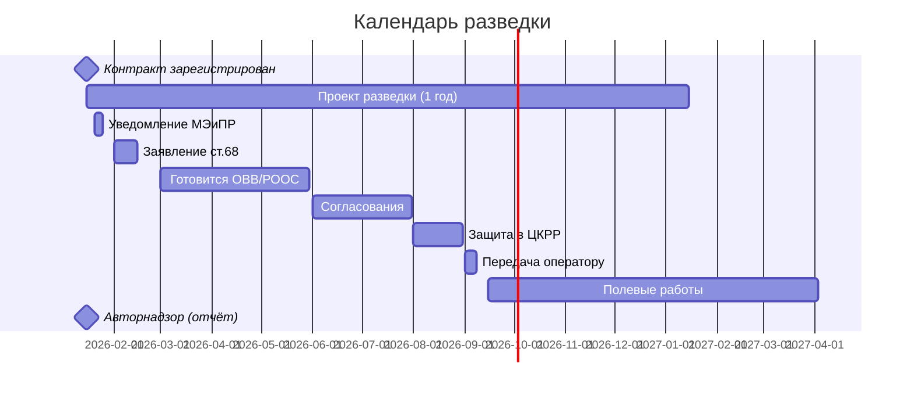

# ⏰ Этап 1 — Сроки и дедлайны

| Событие | Дедлайн | Источник |
|---------|---------|----------|
| Составление проекта разведки | 1 год с регистрации контракта | [[40-KONN-Art-134]] |
| Уведомление МЭиПР | в начале процесса | [[40-KONN-Art-134]] |
| Заявление о намечаемой деятельности | до начала ОВВ/РООС | [[40-EK-Art-68]] |
| Авторнадзор | ежегодно | [[40-KONN-Art-142]] |
| Корректировка местоположения скважин | в рамках авторнадзора | ЕПРКИН гл. 5 п. 55 |

## Календарный шаблон (год работ)

## See also

- [[20.01.00-Overview]] · [[70.06-Fines-and-Deadlines]]
