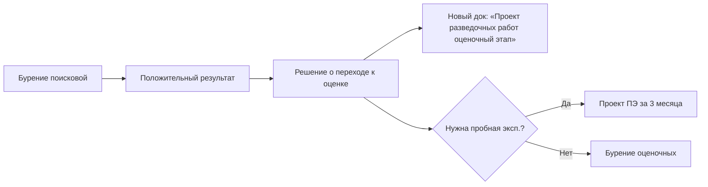

# 💼 Этап 1 — Реальные кейсы

## Кейс 1: Сухопутный контракт, поисковая стадия

**Контекст:** Новый контракт на участок в Атырауской области (сухопутный).

**Хронология:**

| Дата | Событие |
|------|---------|
| 15.01.2024 | Контракт зарегистрирован |
| 20.01.2024 | Подано уведомление в МЭиПР (фаза I) |
| 01.02.2024 | Заявление по ст. 68 ЭК (фаза II) |
| 15.02.2024 | МЭиПР подтвердил: нужен полный ОВВ |
| 01.03.2024 | Старт разработки ОВВ/РООС |
| 01.06.2024 | ОВВ/РООС подан в эко-департамент |
| 15.07.2024 | Согласование получено (фаза IV) |
| 01.08.2024 | Независимая экспертиза (фаза V) |
| 15.09.2024 | Защита в ЦКРР (фаза VI), протокол получен |
| 22.09.2024 | Окончательный вариант у оператора (фаза VII) |
| 15.10.2024 | Старт сейсморазведки 3Д |
| 01.11.2024 | Бурение первой поисковой скважины |

**Подрядчики:**
- Буровой: контракт на 5 скважин
- Геофизик: 3Д на 500 км², ГИС на каждой скважине

**Авторнадзор:** первый отчёт — январь 2025 (через год после старта).

---

## Кейс 2: Морской проект (исключение)

**Контекст:** Шельф Каспия, морская разведка.

**Особенности:**
- ❌ Уведомительный порядок **НЕ применяется**
- ✅ Обязательная **государственная экспертиза** базовых проектных документов
- ✅ Дополнительные согласования: [[50-Forestry-Inspection]] + [[50-ZhaiykKaspii]]
- ✅ Применение [[40-ME-Order-356]] (Приказ МЭ №356 от 30.12.2014, изм. 04.08.2023) — Промбезопасность на море

---

## Кейс 3: Обнаружение залежи — переход к этапу 2

**Контекст:** Поисковая скважина дала положительный результат на этапе разведки.

**Триггерная цепочка:**

Подробно: [[FAQ-Discovered-Reservoir]].

---

## Кейс 4: Корректировка местоположения скважины

**Контекст:** При бурении выяснилось, что в проектной точке тяжёлая поверхность. Подрядчик предложил сдвинуть точку на 200 м.

**Решение:**
- Изменение **местоположения** → авторнадзор (без переутверждения проекта)
- Изменение **количества** → НЕ авторнадзор, нужна корректировка проекта

**Действия:**
1. Документально зафиксировать причину сдвига
2. Внести в годовой отчёт авторнадзора
3. Направить в МЭиПР уведомительно

## See also

- [[20.01.07-FAQ]] · [[FAQ-Discovered-Reservoir]] · [[FAQ-Offshore-Project]]
