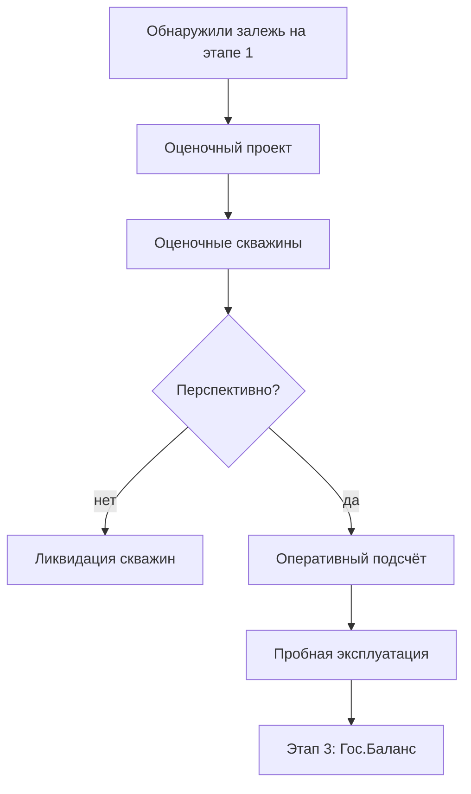

# 2️⃣ Оценка — Overview

## TL;DR

Этап **оценки обнаруженной залежи**: размер, качество, экономическая целесообразность разработки. Здесь же — **пробная эксплуатация** и **оперативный подсчёт запасов**.

## Ментальная модель

> Нашли на разведке → **измеряем** залежь: сколько нефти/газа, какие коллекторские свойства, рентабельно ли. Вопрос: **«стоит ли»**.

## 4 проектных документа этапа

1. [[20.02.01-Project-Razvedki-Otsenochnyy]] — оценочный проект
2. [[20.02.02-Project-Likvidatsii-Razvedki]] — ликвидация неперспективных скважин
3. [[20.02.03-Operativnyy-Podschet]] — первичная оценка запасов
4. [[20.02.04-Project-Probnoy-Ekspl]] — пробная эксплуатация

## Ключевые цифры

- **Срок проекта пробной эксплуатации:** **3 месяца** со дня принятия решения о ПЭ
- **Продление этапа:** до 3 лет на залежь
- **Сложный проект:** этап оценки до 6 лет (см. [[10.03-Contract-Complexity]])

## Поток

## ⚠️ Точка решения о сложности

При выявлении критериев сложности — **обновляется контракт** перед продолжением. См. [[10.03-Contract-Complexity]] и [[FAQ-Complex-Contract]].

## Структура папки

- [[20.02.00-Overview]] ← ты здесь
- [[20.02.01-Project-Razvedki-Otsenochnyy]] · [[20.02.02-Project-Likvidatsii-Razvedki]] · [[20.02.03-Operativnyy-Podschet]] · [[20.02.04-Project-Probnoy-Ekspl]]
- [[20.02.05-Author-Supervision]] — авторнадзор за ПЭ
- [[20.02.06-Common-Mistakes]] · [[20.02.07-FAQ]] · [[20.02.08-Checklist]] · [[20.02.09-Deadlines]]
- [[20.02.10-AI-Training]] · [[20.02.11-Examples]]

## See also

- [[20.01.00-Overview|← Этап 1: Разведка]] · [[20.03.00-Overview|→ Этап 3: Гос.Баланс]]
