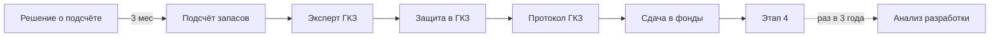

# 3️⃣ Государственный Баланс — Overview

## TL;DR

Этап **официального учёта запасов** в государственном балансе РК. Готовим **полноценный подсчёт запасов** и защищаем в [[50-GKZ|ГКЗ РК]].

## Ментальная модель

> Если оперативный подсчёт — это **«примерно сколько»**, то подсчёт для гос.баланса — **«официально сколько»**. Запись в государственной книге запасов.

## Документы этапа

1. [[20.03.01-Project-Document|«Подсчёт запасов нефти и растворённого газа»]]
2. [[20.03.02-Analiz-Razrabotki|«Анализ разработки месторождения УВ»]]

## Ключевые цифры

- **Срок составления подсчёта:** 3 месяца со дня решения оператора
- **Анализ разработки:** **не реже 1 раза в 3 года**
- **Главный орган:** [[50-GKZ]]

## Поток

## Структура папки

- [[20.03.00-Overview]] ← ты здесь
- [[20.03.01-Project-Document]] · [[20.03.02-Analiz-Razrabotki]]
- [[20.03.06-Common-Mistakes]] · [[20.03.07-FAQ]] · [[20.03.08-Checklist]] · [[20.03.09-Deadlines]]
- [[20.03.10-AI-Training]] · [[20.03.11-Examples]]

## See also

- [[20.02.00-Overview|← Этап 2]] · [[20.04.00-Overview|→ Этап 4]]
