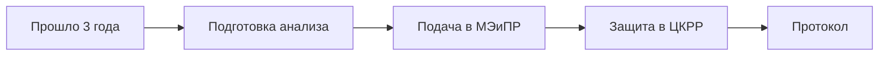

# 📄 «Анализ разработки месторождения УВ»

## Карточка

| Параметр | Значение |
|----------|----------|
| Регулирование | [[40-KONN-Art-6]] + [[40-KONN-Art-142]] (изм. 22.07.2024) |
| Периодичность | **Не реже 1 раза в 3 года** |
| Орган | [[50-TCKRR]] |

## Когда нужен

После того как месторождение в разработке. Периодический контроль того, что разработка идёт по плану.

## Содержание

1. Общие сведения о месторождении
2. История разработки и проектная документация
3. Технология подсчёта запасов
4. **Анализ состояния выработки** запасов
5. Эффективность применяемых технологий
6. Анализ эффективности разработки
7. **Технико-экономические показатели**
8. Обоснование мероприятий
9. Оценка выполнения программы
10. Оценка выполнения проектных решений
11. Выводы и рекомендации

## Что предусматривается (детально)

- Данные о геологическом строении залежи
- Энергетическое состояние разработки
- Пластовое давление, компенсация отбора закачкой агента
- Характеристика динамики добычи УВ, текущая обводнённость
- Состояние работы скважин и их фонда
- Степень нефтегазоотдачи, охват выработки запасов
- Характер вытеснения, продвижение агента
- Контроль работы добывающих, нагнетательных, контрольных скважин

## Фазы

- **I:** Разработка анализа
- **II:** Защита на ЦКРР → протокол

## Workflow

## Источник

[[99-Source-Stand/31-Stage-3-Analiz-Razrabotki]]

## See also

- [[20.03.00-Overview]] · [[70.04-Reserve-Reclassification]]
