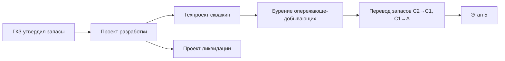

# 4️⃣ Подготовительный период — Overview

## TL;DR

Период между разведкой (с утверждёнными запасами) и **полномасштабной разработкой**. Готовим **проект разработки** и **технические проекты скважин**.

## Ментальная модель

> ГКЗ утвердил запасы → **проектируем добычу**: какие скважины, где, по каким технологиям, на сколько лет.

## Ключевые цифры

- **Срок этапа:** **не более 3 лет**
- **Главная статья:** [[40-KONN-Art-137]] (изм. **22.07.2024**)

## 4 документа этапа

1. [[20.04.01-Project-Razrabotki]] — Проект разработки месторождения
2. [[20.04.02-Project-Likvidatsii-Mestor]] — Проект ликвидации последствий
3. [[20.04.03-Tech-Project]] — Технический проект скважин
4. [[20.04.04-Perevod-Zapasov]] — Перевод запасов (при необходимости)

## Поток

## Структура папки

- [[20.04.00-Overview]] ← ты здесь
- [[20.04.01-Project-Razrabotki]] · [[20.04.02-Project-Likvidatsii-Mestor]] · [[20.04.03-Tech-Project]] · [[20.04.04-Perevod-Zapasov]]
- [[20.04.05-Author-Supervision]]
- [[20.04.06-Common-Mistakes]] · [[20.04.07-FAQ]] · [[20.04.08-Checklist]] · [[20.04.09-Deadlines]]
- [[20.04.10-AI-Training]] · [[20.04.11-Examples]]

## See also

- [[20.03.00-Overview|← Этап 3]] · [[20.05.00-Overview|→ Этап 5]]
