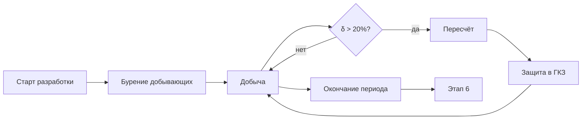

# 5️⃣ Полномасштабная разработка — Overview

## TL;DR

Главный этап добычи. **Промышленная эксплуатация** месторождения по утверждённому проекту разработки.

## Ментальная модель

> Бурим, **добываем годами**. Если запасы меняются больше 20% — пересчёт.

## Ключевые цифры

- **Срок:** ≤ 25 лет (≤ 45 для **крупных/уникальных**)
- **Продление:** до 25 лет
- **Триггер пересчёта:** δ запасов > **20%**

## Документы

1. [[20.05.01-Tech-Project]] — Технический проект скважин
2. [[20.05.02-Pereschet-Zapasov]] — Пересчёт запасов (при δ > 20%)

## ⚠️ Крупные месторождения

> Если начальные запасы > **100 млн т нефти** или > **50 млрд м³ газа** — контракт должен содержать **одно из 5 обязательств** ([[40-KONN-Art-119]] п.7).

## Поток

## Структура папки

- [[20.05.00-Overview]] ← ты здесь
- [[20.05.01-Tech-Project]] · [[20.05.02-Pereschet-Zapasov]]
- [[20.05.05-Author-Supervision]]
- [[20.05.06-Common-Mistakes]] · [[20.05.07-FAQ]] · [[20.05.08-Checklist]] · [[20.05.09-Deadlines]]
- [[20.05.10-AI-Training]] · [[20.05.11-Examples]]

## See also

- [[20.04.00-Overview|← Этап 4]] · [[20.06.00-Overview|→ Этап 6]] · [[FAQ-Reserve-Delta-20]]
