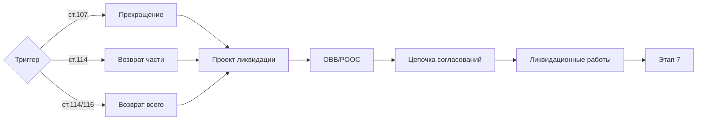

# 6️⃣ Проект ликвидации последствий — Overview

## TL;DR

Подготовка к **закрытию** деятельности: ликвидация скважин, рекультивация земель, восстановление ООС.

## Ментальная модель

> Уходишь с участка → **прибираешься**: законсервировать или ликвидировать скважины, рекультивировать почву, утилизировать оборудование.

## 3 триггера ликвидации

1. **Прекращение права** — [[40-KONN-Art-107]]
2. **Добровольный возврат части** — [[40-KONN-Art-114]]
3. **Возврат всего участка** — [[40-KONN-Art-114]] / [[40-KONN-Art-116]]

## Главные статьи

- [[40-KONN-Art-138]] (изм. **10.06.2025**) — общая о ликвидации
- [[40-EK-Art-9]] — экологический проект
- [[40-EK-Art-67]] — ОВВ/РООС

## Документ этапа

- [[20.06.01-Project-Document|«Проект ликвидации последствий недропользования»]]

## Поток

## Структура папки

- [[20.06.00-Overview]] ← ты здесь
- [[20.06.01-Project-Document]]
- [[20.06.06-Common-Mistakes]] · [[20.06.07-FAQ]] · [[20.06.08-Checklist]] · [[20.06.09-Deadlines]]
- [[20.06.10-AI-Training]] · [[20.06.11-Examples]]

## See also

- [[20.05.00-Overview|← Этап 5]] · [[20.07.00-Overview|→ Этап 7]]
