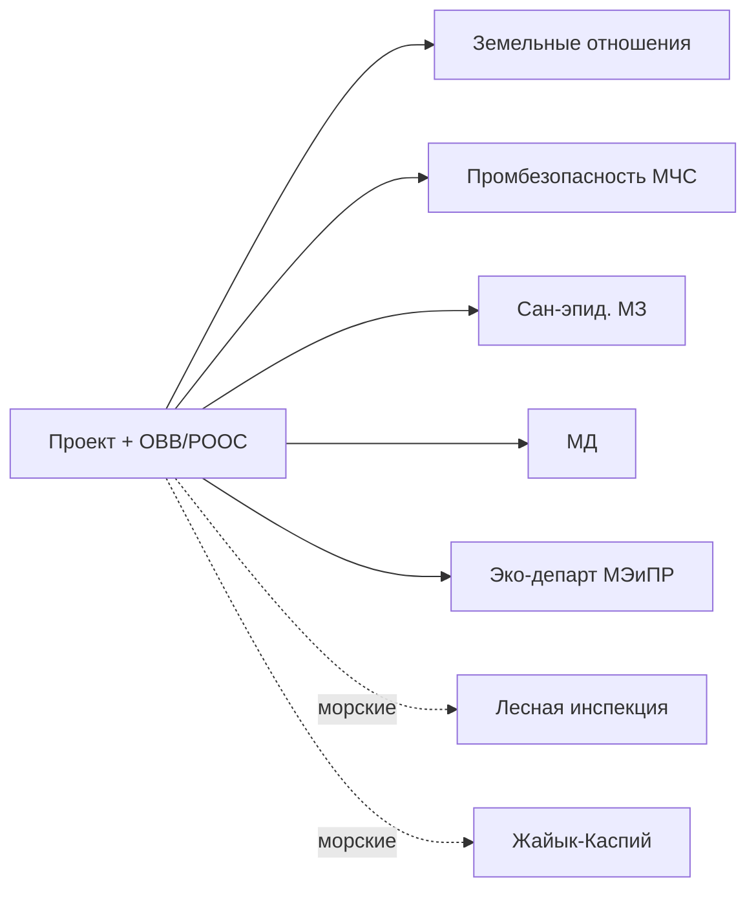

# 📄 «Проект ликвидации последствий недропользования»

## Карточка

| Параметр | Значение |
|----------|----------|
| Регулирование | [[40-KONN-Art-138]] (изм. **10.06.2025**) |
| ОВВ/РООС | [[40-EK-Art-9]] + [[40-EK-Art-67]] |
| Основа | Фактическое состояние участка |

## Когда применяется

1. ✅ Право прекращено — [[40-KONN-Art-107]] (за исключением п.4)
2. ✅ Возврат части — [[40-KONN-Art-114]]
3. ✅ Возврат всего участка

## Нормативная база

- [[40-KONN-Art-138]] (изм. 10.06.2025)
- [[40-EPRKIN-Overview]] (изм. 24.09.2024)
- [[40-ME-Order-200]] — Правила консервации и ликвидации (изм. №66 от 11.10.2024)
- [[40-ME-Order-356]] — Промбезопасность на море (изм. 04.08.2023)
- [[40-Law-188-V]] — «О гражданской защите» (изм. 31.08.2025)
- [[40-EK-Art-9]] + [[40-EK-Art-67]]

## Что предусматривается

- **Анализ** результатов геолого-геофизической изученности
- **Описание методики** полевых работ
- **Безопасность персонала**
- **Охрана недр и ООС**, результаты экологических мониторингов

## ОВВ/РООС

По [[40-EK-Art-67]]. Содержит:
- Характеристика и оценка состояния ООС
- Характеристика социально-экономической сферы
- Анализ производственной деятельности
- Оценка возможных аварийных ситуаций
- Природоохранные мероприятия

## Цепочка согласования (полная!)

## Фазы (I-V)

1. Подготовка проектного документа
2. Заявление по [[40-EK-Art-68]]
3. ОВВ/РООС
4. Согласования
5. Передача оператору

## Источник

[[99-Source-Stand/60-Stage-6-Likvidatsiya]]

## See also

- [[20.06.00-Overview]] · [[20.07.00-Overview|Этап 7]]
