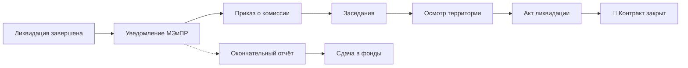

# 7️⃣ Сдача Контрактной территории — Overview

## TL;DR

После ликвидации — **формальная сдача** территории государству. Готовится итоговый отчёт, проводится приёмка комиссией.

## Ментальная модель

> Закончили работы → собираем **все отчёты в один итоговый** → комиссия приходит и принимает территорию → получаем акт.

## 2 документа

1. [[20.07.01-Final-Report|«Окончательный отчёт о результатах ГРР на возвращаемой территории»]]
2. [[20.07.02-Priemka-Akt|Приёмка территории + Акт ликвидации]]

## Поток

## Структура папки

- [[20.07.00-Overview]] ← ты здесь
- [[20.07.01-Final-Report]] · [[20.07.02-Priemka-Akt]]
- [[20.07.06-Common-Mistakes]] · [[20.07.07-FAQ]] · [[20.07.08-Checklist]] · [[20.07.09-Deadlines]]
- [[20.07.10-AI-Training]] · [[20.07.11-Examples]]

## See also

- [[20.06.00-Overview|← Этап 6]] · [[FAQ-Return-Territory]]
