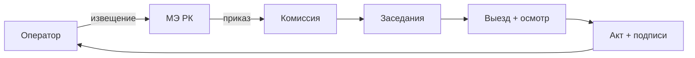

# 🏁 Приёмка возвращаемой контрактной территории

## Карточка

| Параметр | Значение |
|----------|----------|
| Регулирование | [[40-KONN-Art-138]] п. 8-9 + [[40-ME-Order-200]] |
| Результат | **Акт ликвидации последствий недропользования** |

## Фазы (I-V)

### Фаза I — Уведомление в МЭ РК
Письменное извещение в МЭ РК о завершении ликвидационных работ.
Основание: п. 8-9 ст. 138 КОНН + п. 7 Приказа №200 (изм. №66 от 11.10.2024).

### Фаза II — Создание комиссии
МЭ РК создаёт **комиссию по приёмке** работ.
Основание: п. 10-11 Приказа №200.
Артефакт: **приказ МЭ РК** о создании комиссии.

### Фаза III — Заседания комиссии

**Состав комиссии:**
- Недропользователь
- Представитель компетентного органа (МЭиПР)
- Представители уполномоченных органов в области ООС, СЭБН, местных исполнительных органов
- Собственник земельного участка / землепользователь (если ликвидация на частной/долгосрочной земле)

### Фаза IV — Осмотр территории
Комиссия выезжает и **проверяет** фактическое состояние.

### Фаза V — Акт ликвидации
**Акт ликвидации последствий недропользования** с подписями членов комиссии.
Основание: п. 13-14 Приказа №200.

## Workflow

## Источник

[[99-Source-Stand/71-Stage-7-Priemka]]

## See also

- [[20.07.00-Overview]] · [[20.07.01-Final-Report]]
