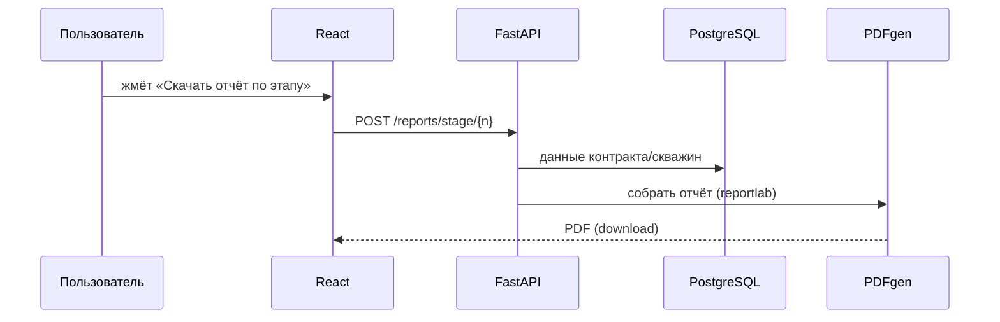

# 🏛️ Архитектура Subsoil Management

## Стек
| Слой | Технология |
|------|-----------|
| Фронтенд | React / TypeScript |
| Бэкенд | Python / FastAPI |
| База | PostgreSQL + pgvector |
| Очереди | Celery + Redis |
| AI | OpenAI (embeddings + GPT-4o), RAG по вольту |
| PDF | reportlab (генерация отчётов/паспортов) |
| База-каркас | Frappe / ERPNext (кастомные DocTypes) |

## Принцип
> Каждый **этап** = набор DocTypes + экран + кнопки, которые **генерируют отчёты** через
> серверный PDF-движок и/или AI. Регуляторное знание — из [[Subsoil-Vault]] (RAG).

## Поток «кнопка → отчёт»

## See also
- [[40.02-Data-Model]] · [[40.04-Button-Report-Map]]
