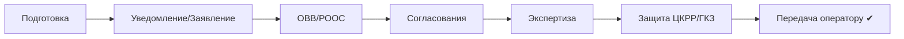

# 🔄 Воронка документа (CRM pipeline)

Каждый документ = карточка в воронке; стадия = фаза I-VII. CRM показывает «узкие места»
(где документ застрял) и дедлайны.

## Статусы
`черновик → подан → на рассмотрении → замечания → утверждён → передан`

## See also
- [[45.01-CRM-Overview]] · [[70.07-Document-Approval-Chain]]
