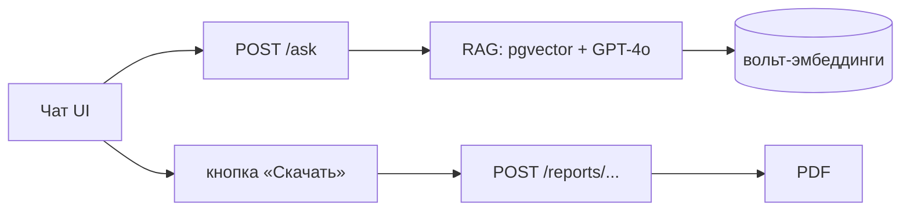

# 🤖 Интеграция чат-бота в Subsoil Management

> Чат-бот = экран AI Assistant. Делает 2 вещи: **отвечает** (RAG по вольту) и **генерирует
> документы** (вызывает отчётный сервис).

## Архитектура

## Поведение (проактивное предложение)
После ответа бот предлагает документ этапа (см. [[90.14-Proactive-Report-Offering]]):
> «📄 Хотите, я подготовлю {документ}? Есть готовый шаблон под вашу компанию.»

## Готовый прототип UI
`subsoil-chatbot.html` — рабочий интерфейс: сайдбар этапов, чат, кнопки скачивания отчётов
и паспортов (генерация прямо в браузере для демо; в проде — через `/reports/...`).

## See also
- [[47.01-API-Endpoints]] · [[90.13-Production-RAG-Pipeline]] · [[90.14-Proactive-Report-Offering]]
