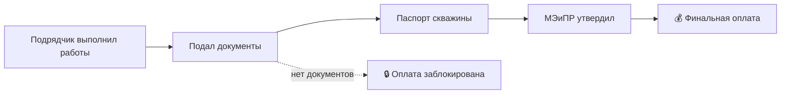

# 💰 Платёжные вехи — блокировка оплаты подрядчикам

## TL;DR

> **Финальная оплата подрядчику заблокирована до утверждения паспорта скважины МЭиПР РК.**

Это **контрактный механизм**, который делает документарное соблюдение **non-negotiable**.

## Ментальная модель: эскроу-аккаунт

> Деньги подрядчика — на эскроу. Условие выхода — утверждённый документ МЭиПР.

## Workflow



## Типовые вехи

| Веха | % оплаты | Триггер |
|------|----------|---------|
| Мобилизация | 10% | Подписание акта |
| Бурение завершено | 40% | Акт промежуточный |
| Испытания пройдены | 20% | Отчёт об испытаниях |
| Паспорт скважины подан | 20% | Подача в МЭиПР |
| **Паспорт утверждён** | **10%** | **Утверждение МЭиПР** |

## Почему это критично

- Подрядчик мотивирован **сдать документы**
- Оператор защищён от **«документального долга»**
- Государство получает **полную информацию**

## В системе

```python
contract.final_payment.released = (
    well.passport_status == "approved_by_meminpr"
    and well.passport_approved_at is not None
)
```

## See also

- [[06-Workflows-MOC]] · [[70.03-Well-Passport-Lifecycle]] · [[FAQ-Payment-Blocked]] · [[FAQ-Subcontractor-Payment]]
