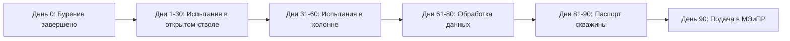

# ⏱️ 90-дневный цикл испытания скважины

## TL;DR

> Стандартный цикл испытания скважины — **90 дней** с момента завершения бурения. По итогам — паспорт скважины.

## Workflow

## Состав работ

- **Геофизические исследования** в открытом стволе и колонне (ГИС)
- **Гидродинамические** исследования (ГДИС)
- Отбор и лаб. изучение глубинных и поверхностных **проб**
- Определение дебита

## Связь с другими процессами

- → [[70.03-Well-Passport-Lifecycle]] — результат цикла
- → [[70.01-Payment-Milestones]] — выплата по испытаниям

## See also

- [[06-Workflows-MOC]] · [[20.01.01-Project-Document]]
