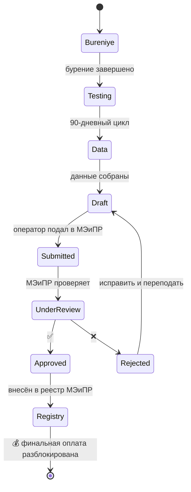

# 📄 Паспорт скважины — точка истины

## TL;DR

**Паспорт скважины** — главный документ по каждой пробуренной скважине. **Без утверждённого паспорта оплата подрядчику заблокирована.**

## Жизненный цикл

## Что в паспорте

- Координаты, глубина
- Конструкция (трубы, колонны)
- Литология
- Результаты ГИС и ГДИС
- Дебиты при опробовании
- Категория (поисковая / оценочная / добывающая / нагнетательная / ликвидированная)
- Связь с проектным документом

## Связь с другими процессами

- → [[70.01-Payment-Milestones]] — блок оплаты
- → [[70.02-90-Day-Testing-Cycle]] — данные для паспорта
- → [[20.07.01-Final-Report]] — паспорта в финальном отчёте

## See also

- [[06-Workflows-MOC]] · [[FAQ-Well-Passport]]
