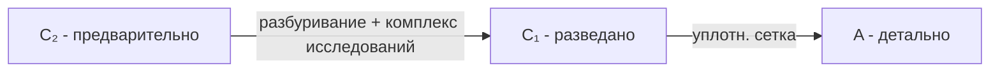

# 🔄 Перевод и пересчёт запасов

## TL;DR

- **Перевод** (этап 4) — повышение категории при новых данных (C₂→C₁→A)
- **Пересчёт** (этап 5) — изменение количества при δ > 20%

## Перевод между категориями



> ⚠️ Перевод возможен **только** при наличии полного комплекса исследований по [[40-MIIR-Order-71|Приказу МИИР №71]].

## Пересчёт при δ > 20%

```python
delta = abs(new_reserves - approved_reserves) / approved_reserves
if delta > 0.20:
    block_approvals()
    trigger_recalculation()
```

См. [[20.05.02-Pereschet-Zapasov]] и [[FAQ-Reserve-Delta-20]].

## Универсальный workflow


## See also

- [[06-Workflows-MOC]] · [[40-MIIR-Order-71]]
