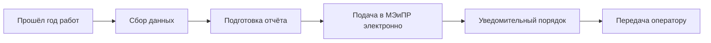

# 👀 Ежегодный авторнадзор — сквозной процесс

## TL;DR

> Каждый год на этапах **1, 2, 4, 5** подаётся отчёт авторнадзора в МЭиПР в **уведомительном** порядке (электронно).

## Где применяется

- [[20.01.05-Author-Supervision]] — за разведкой
- [[20.02.05-Author-Supervision]] — за пробной эксплуатацией
- [[20.04.05-Author-Supervision]] — за разработкой
- [[20.05.05-Author-Supervision]] — за полномасштабной

## Workflow

## Регулирование

- [[40-KONN-Art-142]] — основа
- [[40-EPRKIN-Ch5-Author-Supervision]] — детали
- [[40-EPRKIN-P55-Notification]] — электронный формат

## Что включает отчёт

1. Соответствие фактических параметров проектным
2. Причины расхождений
3. Рекомендации
4. Новые данные о геол. строении
5. Анализ текущего состояния

## Что НЕ требует правки базового проекта

- Изменения **графика бурения** (без уменьшения кол-ва скважин)
- Корректировка **местоположения**
- Изменения **видов/объёмов** исследований
- Корректировка **объектов испытания**

## See also

- [[06-Workflows-MOC]] · [[40-KONN-Art-142]] · [[FAQ-Author-Supervision]]
