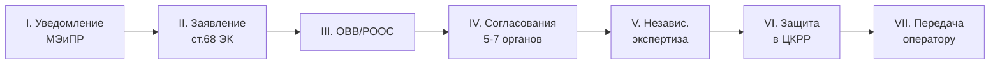

# 📋 Универсальная цепочка согласования

## TL;DR

Любой базовый проектный документ проходит **до 7 фаз**.

## Стандартный шаблон (7 фаз)

## Вариации

| Документ | Особенность |
|----------|-------------|
| Базовый проект (1, 2, 4, 6) | Стандартная цепочка |
| Морской проект | **Госэкспертиза** вместо уведомления (исключение [[40-KONN-Art-113]]) |
| Авторнадзор | Только уведомительный порядок + передача |
| Геол. отчёт | Через [[50-GKZ]] + сдача в фонды (МД + НГС) |
| Финальный отчёт (этап 7) | Через [[50-MD-Zapkaznedra|МД]] (Совет МД) + фонды |

## Кто согласовывает на фазе IV

| Орган | Когда требуется |
|-------|-----------------|
| [[50-MEMINPR]] | Всегда |
| [[50-Department-Eco-Region]] | Всегда |
| [[50-Department-Land]] | Когда затрагиваются земельные участки |
| [[50-MCHS]] | Промбезопасность (особенно для опасных объектов) |
| [[50-MZ]] | Сан-эпид. контроль |
| [[50-MD-Zapkaznedra]] / [[50-MD-Yuzhkaznedra]] | Геологическая часть |
| [[50-Forestry-Inspection]] | **Морские** проекты |
| [[50-ZhaiykKaspii]] | **Морские** проекты |

## See also

- [[06-Workflows-MOC]] · [[10.05-Regulatory-Map]]
