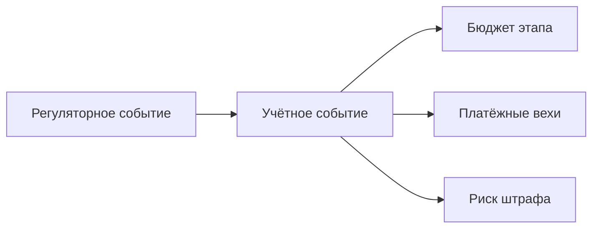

# 💼 Управленческий учёт недропользователя — Overview

## TL;DR

> Управленческий учёт связывает **регуляторные события** (выпуск документа, утверждение паспорта)
> с **деньгами** (бюджет этапа, платёжные вехи, штрафы за просрочку). Это «нервная система» проекта.

## Ментальная модель: документ = финансовое событие

> Каждый регуляторный документ — это **деньги**:
> - Проект → затраты на проектирование
> - Паспорт утверждён → разблокирована оплата подрядчику
> - Просрочка → штраф

## Три опоры

1. **Бюджет по этапам** → [[85.02-Cost-Centers]]
2. **Платёжные вехи** (блокировка до паспорта) → [[85.03-Payment-Events]]
3. **Контроль сроков** (риск штрафов) → [[85.04-KPI-Deadlines]]

## Где в продукте Subsoil

Эти данные — основа экрана **Dashboard** и отчёта по этапу (`Shablon-Otchet-po-Etapu.pdf`, раздел 5).

## See also

- [[08-Reports-By-Stage-MOC]] · [[70.01-Payment-Milestones]]
