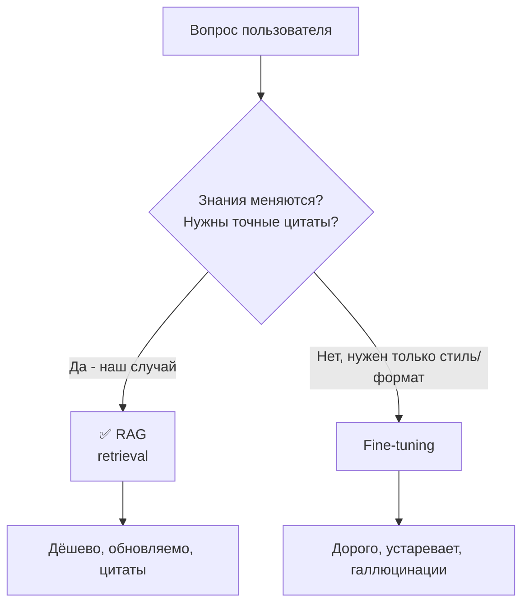

# 🎓 Как «обучить» чат-бота на этом вольте

## TL;DR

> Для базы знаний по недропользованию **fine-tuning (дообучение) — почти всегда ошибка**. Нужен **RAG**: ты не зашиваешь знания в веса модели, а индексируешь вольт и подаёшь нужные заметки модели в момент запроса. Законы меняются (КОНН изм. 10.06.2025, ЭК 29.07.2025) — RAG обновляется за минуты, fine-tuning пришлось бы переобучать.

## Главное недоразумение

«Обучить бота» люди понимают как **fine-tuning** — скормить модели данные, чтобы она «запомнила». Для знаний, которые **меняются** и где **важна точность цитат**, это плохо работает.



## RAG vs Fine-tuning

| Критерий | 🟢 RAG (retrieval) | 🔴 Fine-tuning |
|----------|-------------------|----------------|
| Что делает | Находит нужные заметки → даёт LLM в контекст | Зашивает знания в веса модели |
| Обновление при смене закона | Переиндексировать (минуты) | Переобучить (дорого, долго) |
| Подходит для | **Знания, которые меняются (законы!)** | Стиль, тон, формат ответов |
| Стоимость | Низкая (эмбеддинги + запросы) | Высокая (обучение + переобучение) |
| Точность цитат | Высокая (с источниками) | Низкая (модель «придумывает») |
| Галлюцинации | Меньше | Больше |
| Нужен ли для Subsoil | ✅ **ДА** | ❌ обычно нет |

> 💡 **Вывод:** твой бот = **RAG**. Fine-tuning рассматривай только если потом захочешь жёстко зафиксировать формат/тон ответов — и то **поверх** RAG, не вместо.

## Ментальная модель: RAG = «открытая книга на экзамене»

> Fine-tuning — это заставить студента **заучить** весь учебник наизусть. Если учебник переиздали — студент отвечает по старому.
>
> RAG — дать студенту **открытую книгу** (вольт) и научить **быстро находить** нужную страницу. Переиздали учебник — просто заменил книгу.

## Как работает RAG (4 компонента)

```mermaid
flowchart LR
    subgraph Индексация (один раз + при изменениях)
      V[Вольт .md] --> CH[Чанки ~500 токенов]
      CH --> EMB[Эмбеддинги]
      EMB --> DB[(Vector DB)]
    end
    subgraph Запрос (каждый раз)
      Q[Вопрос] --> QE[Эмбеддинг вопроса]
      QE --> SEARCH[Поиск похожих в DB]
      DB --> SEARCH
      SEARCH --> CTX[Top-k заметок]
      CTX --> PROMPT[Системный промпт + контекст + вопрос]
      PROMPT --> LLM[GPT-4o / Claude]
      LLM --> ANS[Ответ + цитаты]
    end
```

1. **Эмбеддинги** — превращают текст в числа (вектор смысла)
2. **Vector DB** — хранит векторы, ищет похожие
3. **LLM** — генерирует ответ из найденного контекста
4. **Оркестрация** — связывает всё (свой код или LangChain)

## 3 пути реализации

| Путь | Для чего | Срок | Заметка |
|------|----------|------|---------|
| **A. No-code** | Чат с вольтом прямо в Obsidian, сегодня | 10 минут | [[90.12-Obsidian-Plugins-NoCode]] |
| **B. Локально** | Приватно, без облака (Ollama) | 1 час | [[90.12-Obsidian-Plugins-NoCode]] |
| **C. Production** | Встроить в продукт Subsoil (FastAPI) | 1-2 дня | [[90.13-Production-RAG-Pipeline]] |

## Что у тебя уже готово в вольте

- ✅ **Системный промпт** → [[90.01-System-Prompt]]
- ✅ **Стратегия retrieval** → [[90.04-Retrieval-Strategy]]
- ✅ **Глоссарий для эмбеддингов** (синонимы рус/eng) → [[90.08-Glossary-for-Embeddings]]
- ✅ **Структура knowledge base** → [[90.10-RAG-Knowledge-Base]]
- ✅ **Frontmatter и теги** в каждой заметке → метаданные для фильтрации
- ✅ **Атомарность** заметок → идеальный размер чанка

> Вольт **специально построен под RAG**: атомарные заметки = чанки, frontmatter = метаданные, `[[links]]` = граф связей.

## Когда всё-таки fine-tuning

Только если **после** запуска RAG ты заметишь, что модель:
- не держит нужный формат ответа (фаза/статья/срок)
- сбивается с делового тона

Тогда — лёгкий fine-tuning на ~500 примерах из [[90.09-Fine-Tuning-Dataset]] **поверх** RAG. Знания всё равно берутся из retrieval.

## See also

- [[90.12-Obsidian-Plugins-NoCode]] — путь A и B (без кода)
- [[90.13-Production-RAG-Pipeline]] — путь C (pgvector + OpenAI + FastAPI)
- [[07-AI-Training-MOC]] · [[FAQ-How-to-Train-Bot]]
