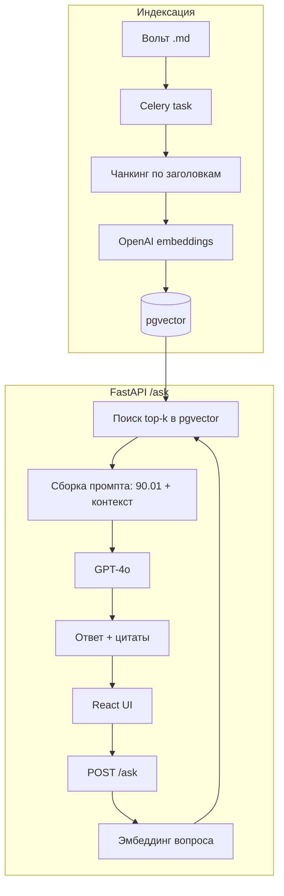

# 🏭 Путь C: Production RAG для продукта Subsoil

> Чтобы встроить AI-консультанта **внутрь Subsoil** (FastAPI + React + PostgreSQL), плагины не подойдут. Нужен свой pipeline. Хорошая новость: **pgvector** живёт прямо в твоём PostgreSQL, а Celery (который уже есть) переиндексирует вольт по расписанию.

## Стек (под твой проект)

| Компонент | Выбор | Почему |
|-----------|-------|--------|
| Vector DB | **pgvector** | У тебя уже PostgreSQL — расширение, не отдельный сервис |
| Эмбеддинги | **OpenAI `text-embedding-3-large`** (3072 dim) | Хорош для русского, одна интеграция, у тебя уже OpenAI |
| Генерация | **GPT-4o** (или Claude) | Качество + длинный контекст |
| Оркестрация | свой код или LangChain | Свой код — меньше зависимостей |
| Переиндексация | **Celery** | Уже есть в стеке |
| API | **FastAPI** | Уже есть в стеке |

> 💡 Контент на русском → `text-embedding-3-large` справляется. Если позже нужна максимальная точность мультиязычного поиска — рассмотри BGE-M3 (self-hosted) или Voyage.

## Архитектура



## Шаг 1: pgvector в PostgreSQL

```sql
CREATE EXTENSION IF NOT EXISTS vector;

CREATE TABLE subsoil_chunks (
    id          TEXT PRIMARY KEY,
    file_path   TEXT NOT NULL,
    title       TEXT,
    stage       TEXT,
    tags        TEXT[],
    content     TEXT NOT NULL,
    embedding   vector(3072)
);

-- индекс для быстрого поиска (cosine)
CREATE INDEX ON subsoil_chunks
    USING hnsw (embedding vector_cosine_ops);
```

## Шаг 2: Индексация вольта

> Готовый скрипт — в поставке: `scripts/build_rag_index.py`. Ключевая логика:

```python
import os, glob, frontmatter, psycopg2
from openai import OpenAI

client = OpenAI()  # OPENAI_API_KEY из окружения
EMB_MODEL = "text-embedding-3-large"

def chunk_markdown(text, max_chars=2000):
    """Делим по заголовкам ## , длинные секции — дополнительно."""
    parts, buf = [], []
    for line in text.splitlines():
        if line.startswith("## ") and buf:
            parts.append("\\n".join(buf)); buf=[]
        buf.append(line)
    if buf: parts.append("\\n".join(buf))
    # доп. деление слишком длинных
    out = []
    for p in parts:
        if len(p) <= max_chars: out.append(p)
        else:
            for i in range(0, len(p), max_chars):
                out.append(p[i:i+max_chars])
    return [c for c in out if c.strip()]

def embed(texts):
    r = client.embeddings.create(model=EMB_MODEL, input=texts)
    return [d.embedding for d in r.data]

def index_vault(vault_dir, conn):
    cur = conn.cursor()
    cur.execute("TRUNCATE subsoil_chunks")  # полная переиндексация
    for path in glob.glob(f"{vault_dir}/**/*.md", recursive=True):
        if "/80-Templates/" in path:        # шаблоны не индексируем
            continue
        post = frontmatter.load(path)
        meta = post.metadata
        chunks = chunk_markdown(post.content)
        if not chunks: continue
        vecs = embed(chunks)
        rel = os.path.relpath(path, vault_dir)
        for i, (c, v) in enumerate(zip(chunks, vecs)):
            cur.execute(
                """INSERT INTO subsoil_chunks
                   (id, file_path, title, stage, tags, content, embedding)
                   VALUES (%s,%s,%s,%s,%s,%s,%s)""",
                (f"{rel}::{i}", rel, meta.get("title"),
                 str(meta.get("stage","")), meta.get("tags",[]),
                 c, v))
    conn.commit()
    print("Индексация завершена")
```

## Шаг 3: Endpoint /ask (FastAPI)

```python
from fastapi import FastAPI
from pydantic import BaseModel
from openai import OpenAI
import psycopg2

app = FastAPI()
client = OpenAI()

# Системный промпт берём из заметки 90.01-System-Prompt
SYSTEM_PROMPT = open("vault/90-AI-Training/90.01-System-Prompt.md").read()

class Ask(BaseModel):
    question: str
    stage: str | None = None   # опц. фильтр по этапу

@app.post("/ask")
def ask(q: Ask):
    # 1. эмбеддинг вопроса
    qv = client.embeddings.create(
        model="text-embedding-3-large", input=q.question
    ).data[0].embedding

    # 2. retrieve top-k (с опц. фильтром по этапу)
    conn = psycopg2.connect(dsn=...); cur = conn.cursor()
    where = "WHERE stage = %s" if q.stage else ""
    params = ([q.stage] if q.stage else []) + [qv]
    cur.execute(f"""
        SELECT file_path, title, content
        FROM subsoil_chunks {where}
        ORDER BY embedding <=> %s::vector
        LIMIT 6
    """, params)
    hits = cur.fetchall()

    # 3. сборка контекста
    context = "\\n\\n---\\n\\n".join(
        f"[{t} | {fp}]\\n{c}" for fp, t, c in hits)

    # 4. генерация
    resp = client.chat.completions.create(
        model="gpt-4o",
        messages=[
            {"role":"system","content": SYSTEM_PROMPT},
            {"role":"user","content":
             f"Контекст из базы знаний:\\n{context}\\n\\n"
             f"Вопрос: {q.question}\\n\\n"
             f"Ответь, опираясь ТОЛЬКО на контекст. "
             f"Укажи статьи и файлы-источники."}
        ],
        temperature=0.1,
    )
    return {
        "answer": resp.choices[0].message.content,
        "sources": [{"file": fp, "title": t} for fp, t, _ in hits]
    }
```

## Шаг 4: Переиндексация при изменении вольта (Celery)

```python
from celery import Celery
from celery.schedules import crontab

celery_app = Celery("subsoil")

@celery_app.task
def reindex_vault():
    conn = psycopg2.connect(dsn=...)
    index_vault("vault", conn)

# раз в сутки ночью
celery_app.conf.beat_schedule = {
    "reindex-nightly": {
        "task": "reindex_vault",
        "schedule": crontab(hour=3, minute=0),
    }
}
```

> 🔄 Когда закон меняется → правишь заметку в вольте → Celery ночью переиндексирует → бот отвечает по-новому. **Без переобучения.**

## Стоимость (порядок)

- Эмбеддинги всего вольта (~226 заметок): **центы** (одноразово + при изменениях)
- Запрос: эмбеддинг вопроса (доли цента) + генерация GPT-4o (~1-3 цента/ответ)

## Чек-лист внедрения

- [ ] `CREATE EXTENSION vector` в PostgreSQL
- [ ] Таблица `subsoil_chunks` с `vector(3072)` + hnsw индекс
- [ ] Скрипт индексации (`scripts/build_rag_index.py`)
- [ ] Endpoint `/ask` в FastAPI
- [ ] Системный промпт из [[90.01-System-Prompt]]
- [ ] Celery-задача переиндексации
- [ ] React-компонент чата (AI Assistant — один из 6 экранов)
- [ ] Citations (источники) в UI — кликабельные ссылки на заметки

## See also

- [[90.11-How-to-Train-Chatbot]] · [[90.01-System-Prompt]] · [[90.04-Retrieval-Strategy]] · [[90.10-RAG-Knowledge-Base]]
