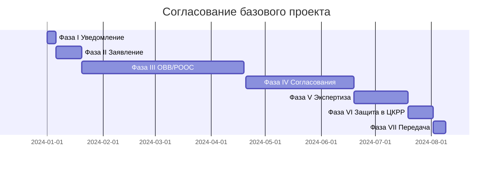

# ❓ Сколько занимает согласование

## Запрос пользователя

> Сколько занимает полная цепочка согласования базового проекта?

## Ответ

**Типовое время (для не-морского проекта):**

**Итого:** ~7-8 месяцев минимум.

**Может затянуться, если:**
- Замечания к ОВВ/РООС
- Несогласованность с одним из 5-7 органов
- Для морских проектов — госэкспертиза вместо уведомления

**Совет:** планировать с запасом, особенно перед дедлайнами этапов.

См. [[70.07-Document-Approval-Chain]] · [[10.05-Regulatory-Map]]

## See also

- [[00-Home]] · [[95-FAQ]]
